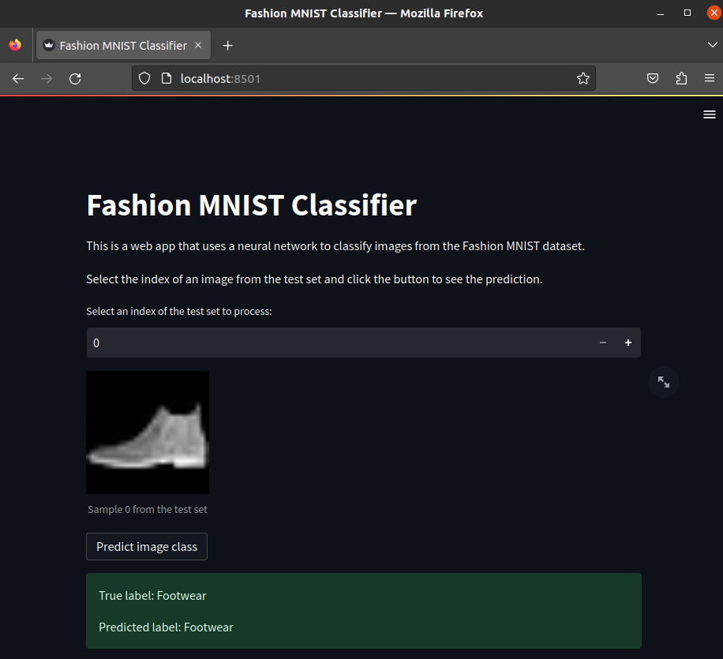

# Fashion-MNIST Classifier

Project to classify images from the Fashion-MNIST dataset using Keras. Instead of using the original dataset, this project merges some of the classes to make it a 5-class problem.

# Project Structure

The project is structured as follows:

```bash
.
├── data
│   ├── original              # Original dataset
│   └── processed             # 5 class dataset
├── Dockerfile
├── models                    # Keras models
├── notebooks
│   ├── analyze_data.ipynb    # Check number of samples per class
│   └── experiments.ipynb     # Experiments with different models
├── plots                     # Plots generated by the notebooks
├── Readme.md
├── requirements.txt
└── src
    ├── 1_download_dataset.py
    ├── 2_transform_dataset.py
    ├── 3_train_network.py
    ├── 4_terminal_prediction.py
    ├── 5_streamlit_prediction.py
    └── utils.py
```

# Setup

I recommend using VSCode with the [Remote Containers](https://code.visualstudio.com/docs/remote/containers) extension. This will allow you to run the code in a docker container with all the dependencies installed using the Dockerfile.

The Dockerfile is based on the official tensorflow docker image with `python 3.8` and takes care of installing the dependencies.

If you prefer to build your own environment, you can use the requirements.txt file.

## Download Dataset

The first time you run the code, you will need to download the dataset and create the 5-label dataset. You can do it with the following steps:

```bash
cd src
python 1_download_dataset.py
python 2_transform_dataset.py
```

## Train Model

You have to train the model and save it to the models folder before using the prediction scripts. You can do it with the following steps:

```bash
cd src
python 3_train_network.py
```

# Streamlit App

I've built a simple streamlit app to test the model. You can run it with the following command:

```bash
cd src
streamlit run streamlit_prediction.py
```

## Screenshot




# Results

The model was trained for 8 epochs (early stopping) with a batch size of 16. The results are as follows:

```bash
              precision    recall  f1-score   support

           0       0.98      0.98      0.98      4000
           1       0.99      0.98      0.99      1000
           2       0.92      0.92      0.92      1000
           3       1.00      1.00      1.00      3000
           4       0.99      0.98      0.98      1000

    accuracy                           0.98     10000
   macro avg       0.97      0.97      0.97     10000
weighted avg       0.98      0.98      0.98     10000


[[3919    1   70    1    9]
 [  11  980    9    0    0]
 [  73    6  917    0    4]
 [   1    0    0 2998    1]
 [  14    0    5    5  976]]
 ```

As we can see, the model performs very well with an accuracy of 98%. All the classes have a F1 score of 0.98 or higher, except for the "One Piece" class, which has a F1 score of 0.92. With the confusion matrix we can see that the model is having some trouble between the "One Piece" and "Upper Part" classes and between the "Upper Part" and "One Piece" classes.


# Conclusions

I have achieved a 98% accuracy on the test set of this reduced version of Fashion MNIST.

I have tried three different CNN models with different number of layers: One small layer, one big layer and three layers.

The best results were achieved with the one big layer, with 98% accuracy.

I also tried two experiments: Using the laplacian of the image and using the largest interior rectangle of the image.

- The laplacian of the image is the second derivative of it and it helps highlighting the edges of the image. I used this data to train the same CNN model as before.

- The largest interior rectangle is the largest rectangle that can be drawn inside the object. I used the coordinates of the rectangle to train a Decision Tree and a Random Forest Classifier (Not the image itself) 

The results for the laplacian were slightly worse than the original images and for the largest interior rectangle were just a 89% accuracy. On the other hand, the prediction time was 100x faster for an individual sample and almost 1000x faster for the whole test set.

Other non-DL approaches that could be tried are calculating the average image of each class and measuring the difference between the input image and the five classes or using the histogram of the image as features.